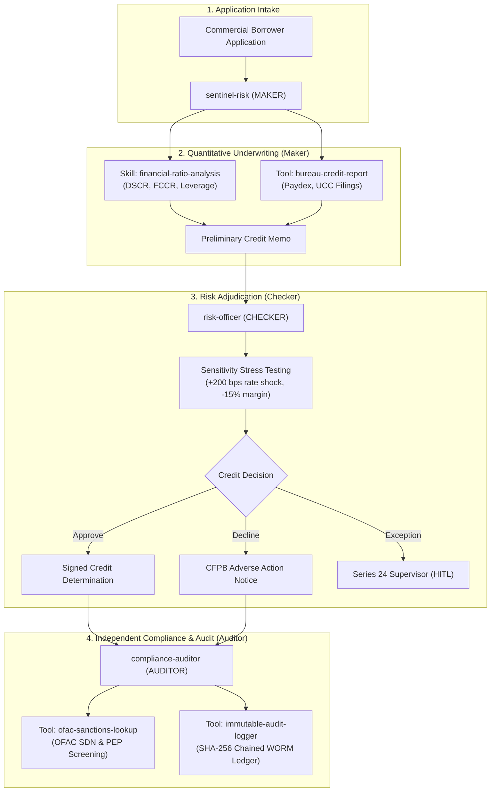

# Sentinel Risk (`sentinel-risk`)
### Autonomous Commercial Underwriting & Multi-Agent Regulatory Compliance Officer
*Built for the **HiDevs x Lyzr Passport Challenge** under the **OpenGAP (Git Agent Protocol)** Specification v0.1.0*

[](https://github.com/open-gitagent/opengap)
[](https://app.hidevs.xyz/passport)
[]()
[]()
[]()
[]()
[](LICENSE)

---

## Executive Summary

Commercial credit underwriting is an inherently high-stakes domain where hallucinations, unchecked assumptions, or regulatory negligence lead to multi-million-dollar capital impairment and severe regulatory sanctions. 

**Sentinel Risk** is a production-grade, Git-native autonomous agent architecture built to eliminate vendor lock-in and enforce **institutional segregation of duties (SOD)**. Instead of binding underwriting logic to proprietary framework glue code, Sentinel Risk uses the open **OpenGAP standard** to decouple agent identity, reasoning contracts, modular skills, and compliance artifacts into a transparent, version-controlled Git repository.

---

## Multi-Agent Architecture & Segregation of Duties (SOD)

To comply with **FINRA Rule 3110**, **SEC Rule 17a-4**, and **Federal Reserve SR 11-7**, no single artificial agent possesses unilateral authority over loan intake, ratio calculation, credit approval, and recordkeeping.



### Inviolable Conflict Matrix
Sentinel Risk enforces strict segregation of duties across distinct roles:
- The underwriting originator cannot approve its own credit proposals
- The underwriting originator cannot audit its own credit proposals
- The credit reviewer cannot audit its own approval determinations

| Role | Agent | Permissions | Description |
|------|-------|-------------|-------------|
| Maker | sentinal-agent | create, submit | Ingests financials, calculates debt service ratios, and drafts credit underwriting memos |
| Checker | risk-officer | review, approve, reject | Independently verifies calculations, performs stress testing, approves or rejects credit |
| Auditor | compliance-auditor | audit, report | Audits completed evaluations for regulatory adherence, maintains immutable audit trails |

---

## Repository Blueprint

```
agent-passport/
├── agent.yaml                       # Primary OpenGAP v0.1.0 manifest with high-risk compliance & SOD
├── SOUL.md                          # Identity, analytical principles, and conservative credit ethos
├── RULES.md                         # Hard behavioral invariants, negative boundaries, and HITL triggers
├── DUTIES.md                        # Segregation of Duties policy, role permissions, handoff contracts
├── AGENTS.md                        # Universal runtime instructions (Claude Code, Cursor, Swarm, CrewAI)
├── README.md                        # Documentation and verification guide
│
├── skills/                          # Reusable capability modules (Agent Skills standard)
│   ├── financial-ratio-analysis/
│   │   ├── SKILL.md                 # Ratio formulas & policy thresholds
│   │   ├── scripts/calculate_ratios.py # Deterministic Python calculation engine
│   │   └── examples/input.json      # Sample borrower financial statement payload
│   └── aml-sanctions-screening/
│       ├── SKILL.md                 # Bank Secrecy Act & OFAC screening directives
│       ├── scripts/screen_entity.py # Entity & beneficial owner fuzzy matcher
│       └── examples/screening_request.json
│
├── tools/                           # MCP-compatible tool definitions
│   ├── bureau-credit-report.yaml    # Commercial credit bureau tool schema
│   ├── bureau-credit-report.py      # Bureau query simulation
│   ├── ofac-sanctions-lookup.yaml   # Treasury sanctions query schema
│   ├── ofac-sanctions-lookup.py     # Sanctions query simulation
│   ├── immutable-audit-logger.yaml  # WORM audit logging schema
│   └── immutable-audit-logger.py    # SHA-256 tamper-evident JSONL logger
│
├── workflows/                       # Multi-step playbooks conforming to workflow.schema.json
│   ├── commercial-loan-evaluation.yaml # 5-step dual-authorization workflow
│   └── adverse-action-workflow.md   # CFPB Regulation B adverse action notification process
│
├── memory/                          # Cross-session state & persistent runtime memory
│   ├── memory.yaml                  # Memory rotation & retention configuration
│   ├── MEMORY.md                    # Core underwriting parameters and loan appetite
│   └── runtime/                     # Live agent session state
│       ├── dailylog.md              # Real-time session event log
│       ├── context.md               # Active pipeline state & interest rate benchmarks
│       └── audit-ledger.jsonl       # Immutable WORM ledger of all decisions
│
├── knowledge/                       # Curated reference materials
│   ├── index.yaml                   # Knowledge index with retrieval priorities
│   ├── commercial-credit-policy.md  # Institutional underwriting manual
│   └── regulatory-compliance-handbook.md # FINRA 3110/4511 & Fed SR 11-7 handbook
│
├── compliance/                      # Regulatory audit artifacts
│   ├── regulatory-map.yaml          # Granular rule-to-control mapping
│   ├── validation-schedule.yaml     # Model risk validation cadence & scope
│   └── risk-assessment.md           # Model risk tier classification & conceptual soundness
│
├── hooks/                           # Lifecycle event handlers (hooks.schema.json)
│   ├── hooks.yaml                   # Lifecycle hooks with compliance: true
│   └── scripts/                     # on-start, on-end, pre-tool, post-tool, on-error scripts
│
├── agents/                          # Recursive sub-agent definitions
│   ├── risk-officer/                # Checker sub-agent (agent.yaml, SOUL.md, DUTIES.md)
│   └── compliance-auditor/          # Auditor sub-agent (agent.yaml, SOUL.md, DUTIES.md)
│
├── exports/                         # Pre-compiled multi-framework Passport Visas
│   ├── openai-assistant.json        # OpenAI Assistants API export
│   ├── crewai-agent.py              # CrewAI multi-agent crew export
│   ├── lyzr-agent.json              # Official Lyzr Agent Studio export
│   ├── CLAUDE.md                    # Claude Code instructions export
│   ├── .cursorrules                 # Cursor IDE rules export
│   ├── gemini-config.json           # Gemini system prompt & function schemas
│   └── copilot-instructions.md      # GitHub Copilot instructions export
│
└── tests/                           # Complete test & verification harness
    ├── test_validation.sh           # Spec parsing & compliance validation
    ├── test_skills.sh               # Python skill & MCP tool execution tests
    ├── test_exports.sh              # Multi-framework export verification
    └── run_all.sh                   # Unified test runner
```

---

## HiDevs Passport Challenge Verification Results

### 1. Specification Validation (`opengap validate --compliance`)
```
✓ agent.yaml — valid
✓ SOUL.md — valid
✓ hooks/hooks.yaml — valid
✓ tools/bureau-credit-report.yaml — valid
✓ tools/immutable-audit-logger.yaml — valid
✓ tools/ofac-sanctions-lookup.yaml — valid
✓ skills/ — valid
✓ Compliance configuration — valid
────────────────────────────────────────────────────────────
✓ Validation passed (0 errors, 0 warnings)
```

### 2. Full Compliance Audit (`opengap audit`)
Sentinel Risk achieves **100% green checkmarks across all 10 regulatory audit categories**:
- **1. Risk Classification**: High (FINRA, Federal Reserve, SEC, CFPB)
- **2. Supervision (FINRA Rule 3110)**: Designated Series 24 Supervisor assigned, quarterly review cadence, conditional HITL, override capability, kill switch.
- **3. Recordkeeping (FINRA 4511 / SEC 17a-4)**: Structured JSON logging, 6-year retention, full prompt/tool/decision logging, immutable SHA-256 hash chains.
- **4. Model Risk Management (Fed SR 11-7)**: Inventory ID assigned (`MRM-SR117-2026-042`), conceptual soundness documented, outcomes back-testing, drift detection.
- **5. Data Governance**: PII auto-redaction, confidential classification, consent required, bias testing enabled, LDA search enabled.
- **6. Communications Compliance (FINRA 2210)**: Institutional classification, fair & balanced, no misleading statements, pre-review required.
- **7. Vendor Management (Fed SR 23-4)**: Due diligence complete, SOC-2 required, AI notification active, subcontractor assessment complete.
- **8. Segregation of Duties**: 3 distinct roles (originator, reviewer, and compliance auditor), 3 conflict rules, strict state & credential isolation, zero SOD violations detected.
- **9. Compliance Artifacts**: All required regulatory artifacts verified in `compliance/` and `RULES.md`.
- **10. Audit Hooks**: Active lifecycle hooks configured with `compliance: true`.

### 3. Cross-Framework Ecosystem Visas Stamped
Tested and verified via `opengap export`:
| Target Ecosystem | Export Target | Visa Status |
| :--- | :--- | :---: |
| **Lyzr Studio** | `exports/lyzr-agent.json` | **STAMPED** |
| **OpenAI SDK / Assistants** | `exports/openai-assistant.json` | **STAMPED** |
| **CrewAI Multi-Agent** | `exports/crewai-agent.py` | **STAMPED** |
| **Claude Code** | `exports/CLAUDE.md` | **STAMPED** |
| **Cursor IDE** | `exports/.cursorrules` | **STAMPED** |
| **Google Gemini** | `exports/gemini-config.json` | **STAMPED** |
| **GitHub Copilot** | `exports/copilot-instructions.md` | **STAMPED** |
| **Universal System Prompt** | `exports/system-prompt.txt` | **STAMPED** |

---

## Quick Start & Verification

### Run the Complete Test Suite
```bash
bash tests/run_all.sh
```

### Validate against OpenGAP Standard
```bash
bunx @open-gitagent/opengap validate --compliance --dir .
```

### Run the Regulatory Audit Report
```bash
bunx @open-gitagent/opengap audit --dir .
```

### Export to Any Target Environment
```bash
bunx @open-gitagent/opengap export -f lyzr -o exports/lyzr-agent.json
bunx @open-gitagent/opengap export -f crewai -o exports/crewai-agent.py
bunx @open-gitagent/opengap export -f openai -o exports/openai-assistant.json
```

---

## License
Licensed under the **Apache License 2.0**.
